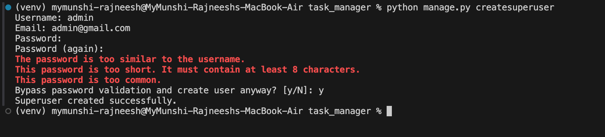

## **🛠️ Task Management API**

A Django-based backend application that provides a set of REST APIs for creating tasks, assigning them to users, and retrieving tasks assigned to specific users.

## **📌 Features**

* Create tasks with name and description.
* Assign tasks to one or multiple users.
* Retrieve all tasks assigned to a specific user.
* Clean and scalable architecture following Django best practices.

## 🧰 Tech Stack

* Python
* Django
* Django REST Framework
* SQLite

## 🚀 Getting Started

### Prerequisites

* Python 3.10+
* pip
* Git

## Installation

#### Clone the repository

git clone https://github.com/rajneesh-y/task_manager.git
cd task-manager

#### Create virtual environment

python -m venv env
source env/bin/activate  # on Windows use `env\Scripts\activate`

#### Install dependencies

pip install -r requirements.txt

#### Apply migrations

python manage.py makemigrations
python manage.py migrate

#### Create a superuser for admin access

python manage.py createsuperuser

password:admin (or open to choose your password)

#### Run the development server

python manage.py runserver

## 🧪 Sample Test User Credentials

You can log in via Django Admin panel:

* URL: `/admin/`
* **Username:** `admin`
* **Password:** `admin` (or your set password)

## 📬 API Endpoints

### 1. **Create Task**

**POST** `/api/tasks/`

{

"name":"Task Creation Josh Talk",

"description":"This is a demo API Test Task creation endpoint For Josh Talk"

}

✅ **Response:**

{

"id":1,

"assigned_users":[],

"name":"Task Creation Josh Tack",

"description":"This is a demo API Test Task creation endpoint For Josh Talk",

"created_at":"2025-03-25T10:51:47.024622Z",

"task_type":"General",

"completed_at":null,

"status":"pending"

}

## **2.Assign Task to User(s)**

**POST** `/api/tasks/{task_id}/assign/`

{"user_id":1}

✅ **Response:**

{

"message":"Task assigned to users successfully."

}

### 3. **Get Tasks for a User**

**GET** `/api/tasks/user/{user_id}`

✅ **Response:**

[{

"id":1,

"assigned_users":[1],

"name":"Task Creation Josh Talk",

"description":"This is a demo API Test Task creation endpoint For Josh Talk",

"created_at":"2025-03-25T10:51:47.024622Z",

"task_type":"General",

"completed_at":null,

"status":"pending"

}]

## 🧼 Code Quality & Structure

* Follows Django project structure
* API logic is separated into serializers, views, and urls
* Proper use of DRF ModelSerializers and ViewSets
